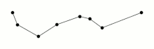
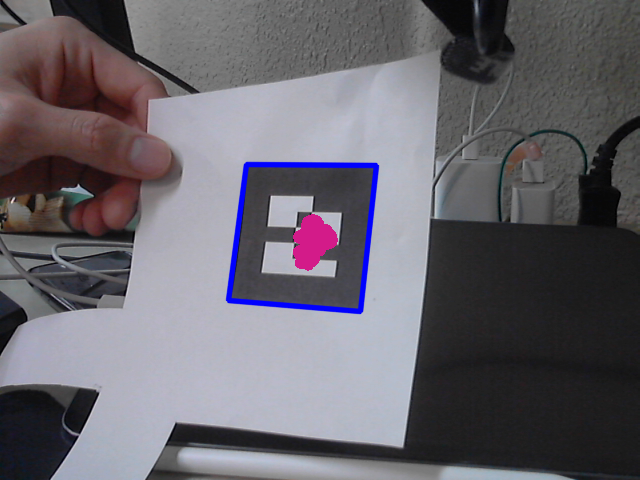

# Rectangular marker detection 

This repository is about rectangular marker detection with OpenCV and Python. 
General method for detection is by detecting four corners of the rectangle markers, and then render 3D model on the marker by using homography.

# Edge detection
To detect the markers, we first extract the contours from the input image, then we used Douglas-Peucker algorithm to reduce the contours until we get the edges of the rectangle markers.

## Douglas-Pucker algorithm
This is an algorithm that decimates a curve composed of line segments to a similar curve with fewer points. 

The starting curve is an ordered set of points or lines and the distance dimension ε > 0.

The algorithm recursively divides the line. Initially it is given all the points between the first and last point. It then finds the point that is farthest from the line segment with the first and last points as end points; this point is obviously farthest on the curve from the approximating line segment between the end points. If the point is closer than ε to the line segment, then any points not currently marked to be kept can be discarded without the simplified curve being worse than ε.

# Rectangle detection
Once we have the edges, we can check if the contour is a rectangle. 
We define the rectangle as follows:
- Contour has four edges
- Contour is convex

# Problems and Solutions

The marker detection did not match the expectations on the detection accuracies.

## Detetion error
We're only detecting the edges of the markers, so we could not differenciate the source marker and detected marker. 

To solve this, we can use feature extraction from detected rectangle.

